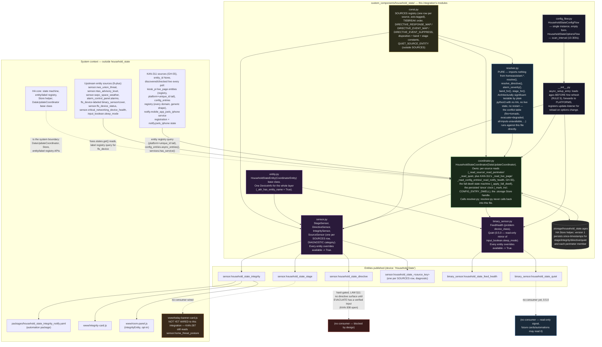

# household_state — architecture

> **Front-end consumers below are HISTORICAL.** Every `www/*.js` card and
> every `dashboards/*.yaml` board this document names was deleted — the card
> fleet and its 54 `/local/` resource registrations by GH-564, the 41 dead
> board files and the card-era tooling by GH-575. Verified live: the Lovelace
> resource registry holds no `/local/` entry and `lovelace/dashboards/list`
> returns `[]`.
>
> What that does and does not invalidate: **the entity, platform and
> resolution content is unaffected** and is still the reference for this
> integration. Only the consumer claims are stale, and they are stale in one
> direction — a card named here as a consumer no longer exists, so "who reads
> this entity" reads as *nobody in this repo* until a dashboard app claims it.
> Those apps live in their own repos (CLAUDE.md §5) and are not greppable from
> here, so absence of a consumer in this document is not evidence there is
> none. A "no consumer found" conclusion reached by grepping `www/` or
> `dashboards/` still holds; the directories it names simply no longer exist.

Siblings: [`household_state_abstract.md`](household_state_abstract.md) (what
this is for, no jargon) · [`household_state_process_flow.md`](household_state_process_flow.md)
(what triggers, in what order) · [`household_state_data_flow.md`](household_state_data_flow.md)
(which value came from where) · [`household_state.md`](household_state.md)
(full technical reference) · [`household_alert_patent_disclosure.md`](household_state_patent_disclosure.md)
(patent-disclosure draft, pinned to the pre-rename name/version — see its
own footer).

This file answers **what the static pieces are and how they compose** —
modules, files, entities, the system boundary. Nothing in this diagram
moves; for control flow and data lineage see the two flow files instead.

## Module diagram

## Why `resolver.py`'s import-freedom is architecturally significant

`resolver.py` imports nothing from `homeassistant.*` — verified against
the file's own import block, which pulls only from `.const`. This is not
an incidental style choice; it is the property that makes the module
testable without a running HA instance, without live state, and without a
restart: `resolve()` and `resolve_directive()` are plain functions over
plain dicts, so the safety-relevant conflict table (fire + tornado
simultaneously, evacuate + degraded integrity, every input unavailable at
once) can be exercised by calling the function directly. `coordinator.py`
is the only module in this tree that touches `hass.states`, the label
registry, or the `Store` helper — every HA-coupled concern is
concentrated there, one layer above the pure logic.

## System boundary

- **Into `household_state`**: `hass.states.get()` reads against the
  upstream entities named in `const.py`'s `SOURCES` registry (none
  declared as HA `dependencies` — a missing one degrades a source, it
  does not block startup), a label-registry query for the `fls_device`
  label (perimeter row), and a raw state read of
  `input_boolean.sleep_mode` (QUIET, outside `SOURCES`). GH-55/KAN-311
  added three more entity_id-None rows on the same "resolve fresh every
  poll, never a pinned list" idiom the perimeter row already used: an
  entity-registry query for `kiosk_pi` live_page sensors (platform +
  unique_id tail, never a host list — `kiosk_live_page`), a
  `config_entries.async_entries()` walk plus per-entry entity-registry
  reads (`config_entry_health`, generic across every domain), and
  `services.has_service()` against the hardcoded notify target plus a
  raw state read of `notify.joels_iphone` (`notify_health`).
- **Out of `household_state`**: six entity classes under one device,
  read by consumers via normal HA entity state (`hass.states`), never a
  direct Python import — `www/*.js` cards and `packages/*.yaml`
  automations are decoupled from this integration's internals by that
  boundary.
- **This integration calls no service and renders no card of its own** —
  confirmed by `__init__.py` (`async_setup_entry` only sets up the
  coordinator and forwards platforms) and by grep across `packages/*.yaml`
  and `www/*.js` finding no `household_state.*` service definition.
