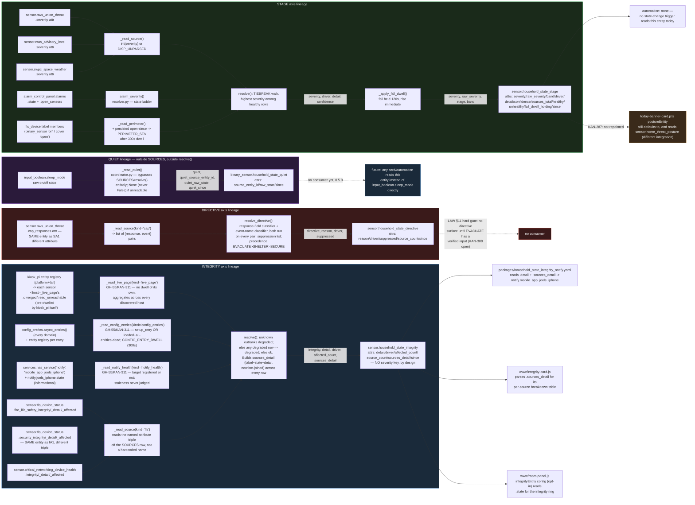

# household_state — data flow

> **Front-end consumers below are HISTORICAL.** Every `www/*.js` card and
> every `dashboards/*.yaml` board this document names was deleted — the card
> fleet and its 54 `/local/` resource registrations by GH-564, the 41 dead
> board files and the card-era tooling by GH-575. Verified live: the Lovelace
> resource registry holds no `/local/` entry and `lovelace/dashboards/list`
> returns `[]`.
>
> What that does and does not invalidate: **the entity, platform and
> resolution content is unaffected** and is still the reference for this
> integration. Only the consumer claims are stale, and they are stale in one
> direction — a card named here as a consumer no longer exists, so "who reads
> this entity" reads as *nobody in this repo* until a dashboard app claims it.
> Those apps live in their own repos (CLAUDE.md §5) and are not greppable from
> here, so absence of a consumer in this document is not evidence there is
> none. A "no consumer found" conclusion reached by grepping `www/` or
> `dashboards/` still holds; the directories it names simply no longer exist.

Siblings: [`household_state_abstract.md`](household_state_abstract.md) (what
this is for, no jargon) · [`household_state_process_flow.md`](household_state_process_flow.md)
(what triggers, in what order) · [`household_state_architecture.md`](household_state_architecture.md)
(the static modules) · [`household_state.md`](household_state.md) (full
technical reference) · [`household_alert_patent_disclosure.md`](household_state_patent_disclosure.md)
(patent-disclosure draft, pinned to the pre-rename name/version — see its
own footer).

This file answers **which value came from where**: source entity attribute,
through which pure function, to which output entity attribute, to which
consumer. For **what triggers, in what order**, see
`household_state_process_flow.md` instead.

## Data lineage, by axis

## Cross-axis fact: two rows, one entity, disjoint attributes

`sensor.nws_union_threat` feeds **two different axes** off two different
attributes of the same entity read (`.severity` into STAGE, `.cap_responses`
into DIRECTIVE) — one HA state read, two independent data lineages. The
same shape repeats for `sensor.fls_device_status`, which feeds **two
INTEGRITY rows** (`fire_life_safety_*` and `security_*` attribute triples)
off one entity. Both are deliberate per `const.py`'s SOURCES comments, not
duplication — `resolve()` never conflates the two lineages because each
row names its own attribute keys, and neither axis's output value is
computed from the other's.

## What never crosses a lineage boundary

- **QUIET's value never enters `resolve()`** and cannot contribute to
  STAGE/DIRECTIVE/INTEGRITY — `const.py`'s module docstring states this is
  deliberate: folding QUIET into `SOURCES` would run a household-activity
  boolean through RULE 2/RULE 4's severity-aggregation machinery, which it
  was never built for.
- **INTEGRITY's inputs never reach STAGE's output.** RULE 4: there is no
  `severity` key on the integrity entity's attributes at all, by
  construction — not by omission in the sensor code, but because
  `resolve()`'s INTEGRITY block never computes one.
- **The fall dwell applies only to the STAGE lineage.** DIRECTIVE and
  INTEGRITY values published each poll are whatever `resolve()` computed
  that cycle, undelayed.
