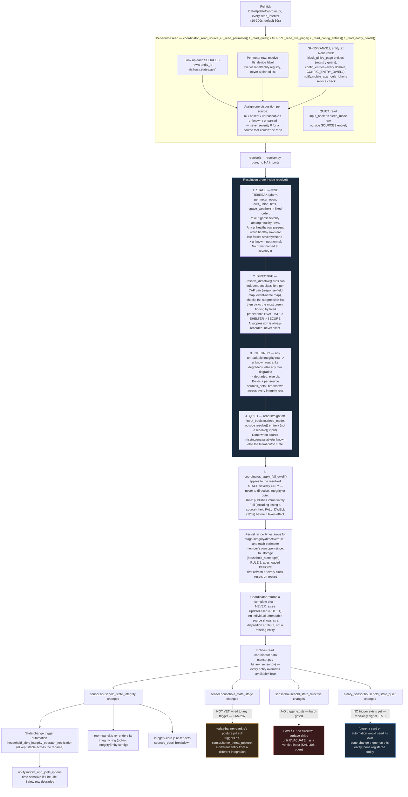

# household_state — process flow

Siblings: [`household_state_abstract.md`](household_state_abstract.md) (what
this is for, no jargon) · [`household_state_data_flow.md`](household_state_data_flow.md)
(which value came from where) · [`household_state_architecture.md`](household_state_architecture.md)
(the static modules) · [`household_state.md`](household_state.md) (full
technical reference) · [`household_alert_patent_disclosure.md`](household_state_patent_disclosure.md)
(patent-disclosure draft, pinned to the pre-rename name/version — see its
own footer).

This file answers **what happens, in what order**, from one poll tick to a
published entity and whatever reads it next. For **what value came from
which source**, see `household_state_data_flow.md` instead — the two are
deliberately separate diagrams per `jrackerby/HA` `docs/PROCESS.md`.

## Control flow, in execution order

## Notes on the ordering above

- **Steps 1-4 inside `resolve()` are sequential in the source, not
  independent.** They read the same `readings` list but write to disjoint
  output keys, so nothing downstream depends on the order in which STAGE,
  DIRECTIVE, INTEGRITY and QUIET are computed within a single call — the
  order shown mirrors `resolver.py`'s actual top-to-bottom layout
  (`resolve()`'s STAGE block, then `resolve_directive()`, then the
  INTEGRITY block; QUIET is computed by the coordinator separately,
  outside `resolve()`, and merged into the same output dict afterward).
- **The fall dwell (step 5) runs after `resolve()` returns, in the
  coordinator, not inside the pure resolver** — `resolver.py` has no
  clock and cannot be, by its own docstring's design intent (a function
  that needs a clock can't be exercised by inspection alone).
- **Persistence and publication are the same poll cycle.** There is no
  separate "commit" step; `_async_update_data()` returns once, and that
  return value is what `coordinator.data` becomes for every entity.
- **QUIET's read has no dependency on STAGE/DIRECTIVE/INTEGRITY and no
  consumer trigger exists yet** — it publishes on the same poll cycle
  but nothing in the diagram above currently reacts to it changing.
